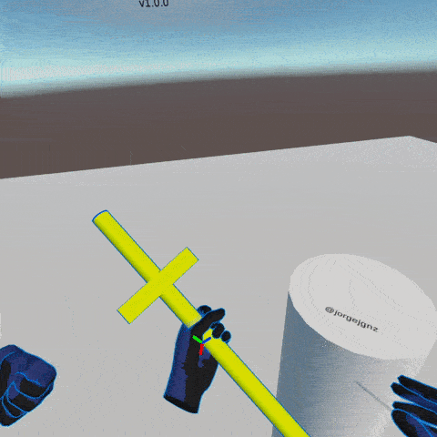

# HPTK
Hand Physics Toolkit (HPTK) is a toolkit to build physical hand-driven interactions from scratch in a modular and scalable way. Hand physics and hover/touch/grab detection are modules included in this toolkit. Only Oculus Quest is supported at the moment.

## Main features
- Structured data model to access body and hand components and calculated variables to compose gestures and trigger actions.
- State-of-the-art hand physics that can be configured in detail through configuration assets.
- Hover/Touch/Grab detection with support to interactions involving multiple objects and hands.
- Mirrored character (dummy)

## Example project
- You can clone a ready-to-go project at [HPTK-Sample](https://github.com/jorgejgnz/HPTK-Sample).

# Supported versions
- Unity 2019.4.4f1 LTS
- [Oculus Integration 20.0](https://developer.oculus.com/downloads/package/unity-integration/)

# Supported target devices
- Oculus Quest - Android

# Getting started with HPTK

## 1. Obtain HPTK

### 1.a. Clone
Clone this repository. To do this, open a command line terminal, rooted on the Assets folder of your Unity project. 
(Hold shift + right click -> Select "Open Powershell Window Here")

Then clone using this command "git clone https://github.com/jorgejgnz/HPTK.git"

    This will clone the master branch of HPTK. This repository does not contain submodules.
	
### 1.b. Import package
Download latest released package (.unitypackage). After that, import it from the Unity Editor by clicking on *Assets/Import package/Custom package*. Then select the downloaded .unitypackage file.

## 2. Import Oculus Integration
Download [Oculus Integration 20.0](https://assetstore.unity.com/packages/tools/integration/oculus-integration-82022) from Asset Store or the [Oculus Archive](https://developer.oculus.com/downloads/package/unity-integration/) and import it.
- Drag and drop the Oculus folder into Assets folder.

    Oculus Integration is a dependency for the InputDataProvider OVRSkeletonTracker, which reads hand data from OVRHand and OVRSkeleton components.

## 3. Project Settings
HPTK relies on nVidia PhysX and Unity's built-in Configurable Joints to simulate hand physics. HPTK has been tested under the following recommended settings:

ProjectSettings/Physics:
- Default Solver Iterations: 20.
- Default Solver Velocity Iterations: 15.
- Friction Type: Two Directional Friction Type.
- Solver Type: Temporal Gauss Seidel.
- Default values for other variables.

ProjectSettings/Time:
- Fixed Timestep: 0.01.

## 4. HPTK Configuration Assets
HPTK includes different configuration assets which default values have already been fine-tuned for a generic purpose. If you need more sensible gesture detection or different hand physics configurations, you can modify the following configuration assets:
- CoreConfiguration
- HandPhysicsConfiguration

    You can create new configuration assets by doing right-click on the Project window in the Unity Editor. Then go to Create/HPTK/*.
	To use these assets, drag & drop them in any CoreModel or HandPhysicsModel component.

## 5. Community and support
If you'd like to discuss your issues or ideas to improve this project, please join the following Discord server: [VRdevs&testers](https://discord.gg/7kRYjX7).
There is a public channel called #HPTK.

# Wiki
Checkout the Wiki for more details about:
- Code architecture.
- Available modules.
- How to build new modules. 

# Author
* **Jorge Juan González** - *HCI Researcher at I3A (UCLM)* - [LinkedIn](https://www.linkedin.com/in/jorgejgnz/) - [@jorgejgnz](https://twitter.com/jorgejgnz) - [ResearchGate](https://www.researchgate.net/profile/Jorge_Juan_Gonzalez) - [GitHub](https://github.com/jormaje)

Acknowledgements:

Nasim, K, Kim, YJ. Physics-based assistive grasping for robust object manipulation in virtual reality. Comput Anim Virtual Worlds. 2018; 29:e1820. [https://doi.org/10.1002/cav.1820](https://doi.org/10.1002/cav.1820)

Linn, Allison. Talking with your hands: How Microsoft researchers are moving beyond keyboard and mouse. The AI Blog. Microsoft. 2016
[https://blogs.microsoft.com/](https://blogs.microsoft.com/ai/talking-hands-microsoft-researchers-moving-beyond-keyboard-mouse/)

# License
[MIT](./LICENSE.md)
